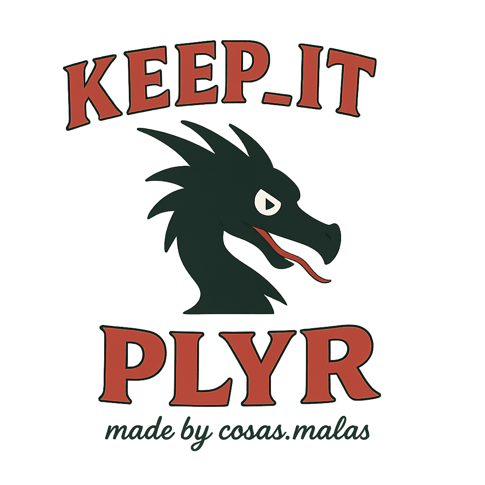

# KEEP-IT PLAYR



A CustomTkinter GUI for playing & downloading YouTube audio, managing playlists & favorites.

## 🚀 Features

- **Play & Download** YouTube URLs  
- **Drag-and-Drop** local MP3/M4A files into the Library  
- **Favorites** (❤) and **Playlists** (📂) support  
- **Search/Filter** in Library and Favorites  
- **Keyboard Shortcuts**:  
  - Space = Play/Pause  
  - ←/→ = Skip backward/forward 10s  
  - ↑/↓ = Volume up/down  
- **Light/Dark** theme toggle  
- **Debian Package** (`.deb`) for easy installation

## 🎯 Installation

1. Install system dependencies:
   ```bash
   sudo apt update
   sudo apt install python3-tk python3-pil mpv yt-dlp python3-requests

    Download & install the Debian package:

wget https://github.com/COFOIndustries/keep-it-playr/releases/download/v1.0.3/keep-it-playr_1.0.3.deb
sudo dpkg -i keep-it-playr_1.0.3.deb
sudo apt --fix-broken install   # if prompted

Launch the app:

    keep-it-playr

🛠 Development

If you want to modify or rebuild the package yourself:

git clone https://github.com/COFOIndustries/keep-it-playr.git
cd keep-it-playr

# Bundle dependencies (only needed when updating vendor/)
# source .venv/bin/activate
# pip install customtkinter tkinterdnd2 darkdetect
# cp -r .venv/lib/python3.13/site-packages/{customtkinter,tkinterdnd2,darkdetect} vendor/

# Build the .deb
./build-deb.sh

# Install & test
sudo dpkg -i keep-it-playr_1.0.3.deb
keep-it-playr

📂 Project Structure

.
├─ assets/                   # icon files
├─ art/                      # official logo & images
├─ src/
│  ├─ main.py
│  └─ mpv_controller.py
├─ vendor/                   # bundled dependencies
│  ├─ customtkinter/
│  ├─ tkinterdnd2/
│  └─ darkdetect.py
├─ build-deb.sh              # packaging script
├─ keep-it-playr_1.0.3.deb   # built package (also in Releases)
├─ playlists/                # user playlists
├─ library/                  # local audio library
├─ favorites.txt             # saved favorites
├─ saved_links.json          # recent YouTube links
├─ .gitignore
├─ LICENSE
└─ README.md
